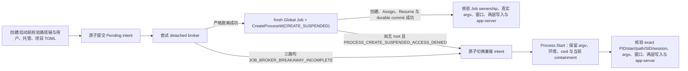

# 架构与安全不变量

## 组件

- `CodexProfileLauncher.Core`：路径规范化、创建/启动前 reparse/junction 拒绝、用户/托管/项目 TOML 分层审计、原子 JSON 注册表、进程 receipt 身份模型、AI 设置与模型 catalog、**按环境技能库**。
- `CodexProfileLauncher`：WPF/Fluent UI（环境页顶部配置 Tab）、Store 包发现、隐藏 Job broker、Win32 原子进程创建、命令行与属主核验、窗口激活/关闭、启动证据聚合；内置技能随构建复制到输出目录 `skills/builtin`。
- `skills/builtin`：随仓库分发的技能模板（含 `SKILL.md` 的目录树）。
- `Core.Tests`、`Windows.Tests` 与 `JobBroker.TestHost`：纯逻辑边界测试，以及不启动真实 Codex 的 Windows Job/broker/进程身份集成测试。

Release 保留 embedded Portable PDB 的文件名与行号用于现场诊断，同时通过 MSBuild PathMap 把各项目的编译机物理目录映射为 /_/<项目名>。因此发布版异常仍能定位源文件与行号，但不会显示或访问开发机绝对路径；Debug 构建不应用该映射。

## 环境身份

环境 UUID 与数据根在创建后保持不变。根下固定使用：

```text
DataRoot
├─ .launcher
│  ├─ ai-settings.toml
│  ├─ model-catalog.json
│  ├─ system-prompt.md
│  └─ skills-disabled\     # 禁用保留
├─ codex-home
│  ├─ config.toml
│  ├─ managed_config.toml
│  ├─ skills\              # Codex 发现的用户技能（勿改 .system）
│  └─ log
└─ app-data
```

创建环境及每次启动前，都会检查 `DataRoot`、`codex-home`、`app-data` 与 TOML 显式状态路径的现存路径链。`DataRoot` 必须是完整绝对路径，不能是 UNC/网络路径、网络盘、移动盘、磁盘根，不能与受保护的系统/当前 Codex 根或其他 profile 数据根重合或互相嵌套；目录创建前后都会拒绝路径链中的 reparse point/junction。TOML 显式状态路径必须是位于当前 `DataRoot` 内的绝对目录路径，也会拒绝现有文件与 reparse/junction。

`WorkingDirectory` 只是 Codex root 的进程工作目录：留空时使用 `DataRoot`；显式填写时必须是完整绝对路径，可以位于 `DataRoot` 之外。当前实现不会把 `DataRoot` 专属的网络/移动盘、磁盘根、系统目录或 profile 重叠限制套到工作目录上，但会在创建目录前后及每次启动前拒绝其现存路径链中的 reparse point/junction；目录不存在时会创建。

进程恢复后，完成判据不会声称再次扫描上述路径链或重新证明 reparse 状态；运行期证据是根进程真实 argv、可见窗口、当前 `app-data` 与 `CODEX_HOME` 的本次启动后写入，以及同一 Job 中的 Codex `app-server`。因此路径链校验是创建/启动前门禁，启动后证据用于证明实际运行实例使用了目标环境。

用户可编辑的 `config.toml` 必须把 `cli_auth_credentials_store` 与 `mcp_oauth_credentials_store` 精确设为小写 `"file"`，显式 `sqlite_home`/`log_dir` 必须是 `DataRoot` 内、不经过 reparse point/junction 的绝对路径。启动器另行原子创建且每次启动审计 `managed_config.toml`，要求四个隔离关键项分别精确锁定为文件型凭据、当前 `codex-home` 和其 `log` 子目录；已有文件不会被静默覆盖。工作目录的 `config.toml` 及从工作目录向上的每一级 `.codex/config.toml` 也会严格解析，只要任一项目层包含这四个关键项、把 `desktop.runCodexInWindowsSubsystemForLinux` 设为 `true`/非布尔值，或无法核验，启动即 fail-closed。这样既利用 Codex 当前的最高优先级托管层锁定最终值，也不依赖单一配置优先级假设来掩盖项目覆盖。

WSL 后端被明确排除：当前桌面版会为 Linux Codex 硬编码 Linux 用户级共享 SQLite 目录，而且 Linux 进程不会读取 Windows profile 内的 `managed_config.toml`。即使后续的 Windows app-server 证据会失败，也不能容许一个已经接触共享状态的 Linux app-server 先启动。因此默认配置显式写入 `desktop.runCodexInWindowsSubsystemForLinux = false`，用户配置缺失、`true` 或非布尔值都会在 root 创建前被阻止；显式 `false` 优先于并使旧版 `.codex-global-state.json` 中的遗留开关失效，不依赖清理该遗留值。项目层对该键的 `true`/非布尔值同样保守拒绝。

## 启动事务



Pending intent 在启动 broker 前写入带 revision 的原子状态文件，包含 ownership mode/version、Windows session、profile/launch UUID 派生的 Global Job 与 ready event 名称。多个 launcher 即使同时读取旧状态，也只有一个能成功提交 intent；全局、按用户 SID 命名的 UI mutex 同时阻止同一用户跨桌面会话打开第二个可见启动器。

broker 是同一单文件 EXE 的隐藏 `--job-broker` 模式，并在 UI mutex、日志和 WPF 初始化前分流。它持有命名 Job handle；Job 永久启用 `KILL_ON_JOB_CLOSE`，所以 broker 异常退出会由内核 fail-closed 结束全部成员。启动 broker 时优先 `CREATE_BREAKAWAY_FROM_JOB`；若外层 Job 禁止 breakaway（常见于聊天软件/浏览器/解压工具打开），则回退为 `PROC_THREAD_ATTRIBUTE_PARENT_PROCESS` 指定同会话 `explorer.exe` 作为父进程。部分托管桌面的 `explorer.exe` 自身也属于 Job，此时父进程属性会按 Win32 契约继承该 Job，因此第三条路径通过 `System.Management` 调用本机 WMI `Win32_Process.Create`，并把 `Win32_ProcessStartup.CreateFlags` 显式设为 `CREATE_BREAKAWAY_FROM_JOB (0x01000000)`。WMI 只负责创建自包含 broker；root 所需的完整 Unicode 环境仍经已认证 pipe 请求交给 broker。三条路径创建后都反查 broker 的映像、属主、session、存活状态及已脱离所有 Job 才继续；broker 本身不得属于 outer Job 或它持有的 inner Job。root 在恢复主线程前只归属本次 fresh inner Job。

兼容模式只有两个精确入口：三条严格 broker 路径最终汇总为 `JOB_BROKER_BREAKAWAY_INCOMPLETE`；或 detached broker 已建立 fresh 空 Job，但 `CreateProcessW(CREATE_SUSPENDED)` 在尚未创建任何 root 时返回 AccessDenied，并由错误产生点分类为 `PROCESS_CREATE_SUSPENDED_ACCESS_DENIED`。调用层会把已经持久化的 Windows Job pending intent 原子转换为 `legacy-process-tree` 兼容 intent，再用同一个 `ProcessStartInfo` 在当前系统 containment 中创建 Codex，因此原始 `ArgumentList`、环境块与工作目录保持不变。返回后仍固定并核验 exact native handle、映像、当前用户 SID、session 与存活状态；`IsProcessInJob(..., NULL)` 只作为诊断事实记录，不再作为兼容路径的可用性门禁。随后仍执行相同的数据隔离证据门禁。UI、状态详情与日志都明确标注兼容模式不保证专用 Job 或独立存活；普通创建错误以及 Job 分配、线程恢复、身份、路径、配置或持久化错误不会触发降级。兼容 intent 在创建前持久化，创建后的 PID/start/path receipt 再持久化；中途崩溃由现有精确 argv discovery 恢复，不以空 receipt 冒充停止。

启动请求的环境块以父进程环境为基础，显式移除 `OPENAI_API_KEY`、`CODEX_API_KEY` 与 `CODEX_ACCESS_TOKEN`，覆盖当前环境的 `CODEX_HOME`、`CODEX_SQLITE_HOME`，其余环境变量继承。broker 清空自己的 `ProcessStartInfo.Environment` 后按请求重建该环境块，避免 broker 自身环境意外改变 root 的输入；这不等同于复制或迁移任何磁盘登录/会话数据，也不代表隔离所有系统级凭据来源。

严格 Windows Job 模式下，Codex root 不经 `Process.Start` 创建。broker 是实际 Win32 `CreateProcessW` 调用方；实现中的托管 P/Invoke 方法名为 `CreateProcess`，但 `LibraryImport` 明确把 `EntryPoint` 绑定到 `CreateProcessW`。broker 传入显式应用路径、argv、Unicode 环境块和工作目录，以 `CREATE_SUSPENDED | CREATE_UNICODE_ENVIRONMENT` 且不继承句柄的方式创建 root；在主线程尚未运行时立即调用 `AssignProcessToJobObject`，并反查 Job 已启用 `KILL_ON_JOB_CLOSE`、root 是 fresh Job 的唯一成员，且路径、创建时间和 Windows session 与请求一致。`CreateProcessW` 返回 false 时先保存原始 native error；仅 AccessDenied 被专门分类，而此时 `createdProcess=false` 且 Job 仍为空。其他任一步失败都会在恢复主线程前终止新进程或整个 Job，不允许回退掩盖已经创建过 root 的失败。

broker 随后通过 `DuplicateHandle` 把受限 process/thread handles 复制到已核验 launcher。launcher 再次核验 PID、TID、thread owner、Job membership、路径、创建时间和 session；只有 `ResumeThread` 返回 1 才接受恢复。same-user named pipe 与 pinned Job handle 会一直保留到 launcher 原子持久化 Resumed receipt 并发送 `commit-durable`。在 durable commit 前，launcher 退出、pipe 断开、超时、畸形协议帧、显式 abort 或持久化失败都会 fail-closed 终止整个 Job。

## 完成判据

两种模式都只有同时满足以下共同事实才显示“运行中”：

1. PID、进程创建时间和 Store 包 EXE 路径与 receipt 一致；
2. 根进程 argv 精确包含当前环境 `--user-data-dir` 与 `--new-window`，且不是 Chromium `--type=` 子进程；
3. 根进程存在可见窗口；
4. 当前 `app-data` 在本次启动后产生状态写入；
5. 当前 `CODEX_HOME` 在本次启动后产生 installation/SQLite 状态证据；
6. 已核验的根进程树中存在 Codex `app-server`，且进程树检查无错误。

严格模式还必须在 root resume 和 durable commit 前证明 Global Job 名称、`KILL_ON_JOB_CLOSE`、root membership 与 exact broker PID/start/path/SID/session/argv 全部匹配。兼容模式明确不宣称这项 Job 所有权，也不把 `IsInAnyJob=true` 当成数据隔离失败。因此 HTTP 状态、单一窗口或单一目录时间戳都不足以宣称隔离成功。

## 停止与恢复

同一 Windows session 中先再次核对 exact broker、root receipt、Job membership 与 argv，再向窗口请求正常关闭；跨 session 不发送窗口消息。正常完成只以同一 pinned Job generation 连续稳定为空为准。若后台仍驻留，只有用户再次明确确认后才在同一 pinned handle 内复核 generation 并调用 `TerminateJobObject`，随后仍在该 handle 上等待稳定空。

Pending 恢复不猜测或恢复线程：ready Job 存在时按 exact broker generation 整组终止；Job 与 signal 双缺超过有界窗口后，还要连续确认 broker、root、已观察身份和 profile argv 均无残留才清 receipt。broker 卡在 ready 前时，只在 pinned Job 为空、ready 未置位、原 parent generation 已消失且 broker generation 精确匹配时回收。root 已 resume 但 `commit-durable` 尚未收到时，broker 仍把 launcher generation 与 pipe 视为 pre-commit owner；launcher 硬退出、pipe 断开或超时会终止整个 Job。Resumed Job 名称丢失也必须通过两次缺名与全套 exact drain 证据才能清理。兼容模式和旧版本 receipt 走 legacy PID/start/path/argv lease 与已观察进程树路径，不宣称 Job 保证；兼容 pending intent 若发现唯一精确 argv root，则重建 receipt 并重新收集完整隔离证据。

## 持久化

`profiles.json` 使用独占锁、临时文件、写穿、磁盘 flush、读回校验、原子 replace 与 `.bak`。读取和写入都会做语义校验：schema、唯一非空 UUID、绝对且不重叠的根、有效选中项，以及 receipt 的 profile/launch/name/session/phase/PID 一致性。合法 JSON 但语义损坏时显式报错，不会替换为空注册表。

配置编辑同样用原子写入。保存前会比较加载时内容与当前磁盘内容，外部程序已更新时阻止覆盖。

## v1.1 快捷 AI 配置

每个环境使用独立的 `.launcher/ai-settings.toml` 与 `.launcher/system-prompt.md`。前者保存 schema、API 启停、Base URL、完整明文 Key、`selected_model`、`model_reasoning_effort` 与提示词启停；后者保存完整提示词。加载与保存均持有 profile 级文件锁，使用临时文件和原子替换，并以设置文件与提示词内容的组合 SHA-256 作为 revision。外部修改导致 revision 不匹配时拒绝覆盖；多文件保存失败会恢复设置、提示词和受管配置。

快捷配置不改写用户的 config.toml。启用 API 时：

1. 对当前 Base URL **实时** `GET /models`（打开 AI Tab / 测试 / 刷新 / 保存 / 启动 resolve 均如此；列表不以磁盘旧 catalog 为真值）。
2. 校验用户选定的 `selected_model` 必须出现在当次实时列表；为空则取第一项。
3. 将当次结果写成 profile 内 `.launcher/model-catalog.json`（Codex `model_catalog_json` 格式，含第三方非 GPT slug；`supported_reasoning_levels` 含 minimal→ultra 完整阶梯）。
4. `managed_config.toml` 派生 `model`、`model_reasoning_effort`、`model_catalog_json`、独立 `model_provider` 及 provider table（base_url 原样、专用 env_key、`wire_api = responses`、`requires_openai_auth = false`）。

Key 本身只在明文设置文件中。启用提示词时写入当前 profile 提示词文件的绝对 `model_instructions_file`。关闭开关会移除对应受管覆盖并保留用户内容；实时拉取失败时保存/启动硬失败，禁止用过期 catalog 伪装成功。

每次启动重新读取磁盘，若 API 启用则再次实时拉取并重建 catalog 与受管层。进程环境先清除父进程的通用凭据与启动器专用 Key，再仅在当前 profile 启用 API 时注入该 Key。因此不同环境不能通过继承的环境变量串用 Key，且 Key 不进入启动参数、receipt、日志或发布物。

UI 主路径：环境页 **AI Tab** 内嵌 `AiSettingsPanel`（不再以模态对话框为产品主入口；协调器仍可构造 ViewModel）。

## v1.2 按环境技能库

### 权威路径

| 层 | 路径 | 角色 |
| --- | --- | --- |
| 内置模板 | 应用旁 `skills/builtin/<id>/`（源：仓库 `skills/builtin`） | 只读模板；解析 frontmatter `name` / `description` |
| 已启用 | `ProfilePaths.SkillsDirectory` = `codex-home/skills/<id>/` | Codex 在 `CODEX_HOME` 下发现用户技能 |
| 已禁用 | `ProfilePaths.SkillsDisabledDirectory` = `.launcher/skills-disabled/<id>/` | 保留本地修改，不被 Codex 加载 |
| 系统 | `codex-home/skills/.system/` | **禁止**启动器修改/删除 |

不把用户全局 `~/.agents/skills` 当作环境隔离真值：启动器只设置 `CODEX_HOME` / `CODEX_SQLITE_HOME` 指向 profile，不改写 `HOME`。

### 服务

`IProfileSkillsService` / `ProfileSkillsService`：

- `List`：合并内置清单 + 启用目录 + 禁用目录；标记是否已定制（`SKILL.md` 哈希对比内置）。
- `SetEnabled`：启用 = 从禁用目录迁回或从内置复制；禁用 = 移入 `skills-disabled`。
- `SaveSkillMarkdown` / `ResetToBuiltin` / `ImportFromFolder` / `InstallAllBuiltin`。
- 新建与复制环境在 `EnsureInitialized` 后调用 `InstallAllBuiltin`（已有目录跳过，避免覆盖用户副本）。

### UI

环境页 **技能 Tab**（`SkillsPanel`）：搜索、开关、`SKILL.md` 编辑器、安装全部内置、导入文件夹、打开 skills 目录。切换环境/关闭时未保存的 `SKILL.md` 与 AI 配置一并纳入脏状态确认。

## v1.3 Keysmith 执行模式（预装）

对 [codex-keysmith](https://github.com/Jia-Ethan/codex-keysmith) 的**原生等价集成**（不调用 Python）：

| 机制 | 实现 |
| --- | --- |
| 指令文本 | 嵌入 `Assets/keysmith/gpt-unrestricted.md`（与上游 SHA-256 一致） |
| 生效路径 | `KeysmithBootstrap.ApplyAsync` → 写 `.launcher/system-prompt.md` + `codex-home/gpt-unrestricted.md` |
| 配置锁定 | `managed_config.toml` 写入绝对路径 `model_instructions_file`（`SystemPromptEnabled=true`，产品默认始终开启） |
| Hooks | 将 `hooks.json` 移为 `hooks.json.disabled`（与 keysmith 默认隔离一致） |
| 触发点 | Keysmith **默认开启**；`SaveAsync` / `ResolveLaunchConfigurationAsync` 在 `keysmith_mode_enabled=true` 时确保写入 |
| UI | AI Tab「Keysmith 执行模式」开关（`ProfileAiSettings.KeysmithModeEnabled`，缺省 true） |
| 默认提示词 | Keysmith 开：`codex-home/gpt-unrestricted.md`；关：operator-core → `codex-home/system-prompt.md` |

边界：这是配置层指令注入，不是二进制补丁或网络劫持；实际“是否拒绝”仍受上游模型与中转网关策略影响。
